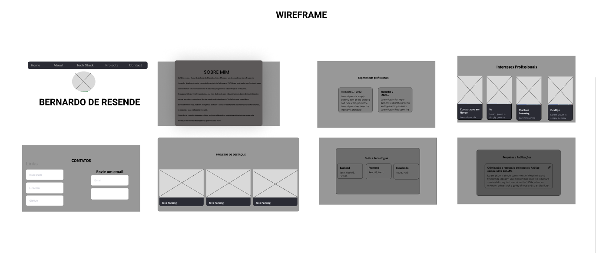
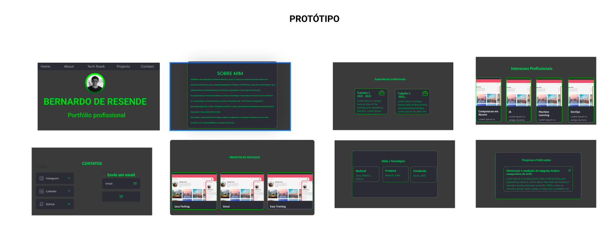

# 📚 Portfolio Bernardo de Resende - Engenheiro de Software

Este projeto é um portfolio pessoal moderno e interativo que demonstra minhas habilidades, experiências e projetos. O website apresenta uma interface futurística com animações suaves, design responsivo e elementos visuais dinâmicos, proporcionando uma experiência envolvente para mostrar competências técnicas e trajetória profissional.

**🌐 [Acessar Site Hospedado](https://bernardoresende.vercel.app/)**

## 🎨 Design e Prototipação

### Wireframe
O wireframe foi desenvolvido no Figma com foco em média fidelidade, apresentando a estrutura visual e organizacional do portfolio:



**🔗 [Visualizar Wireframe e Protótipo no Figma](https://www.figma.com/design/GtvbLxqT0sGX1DkHYYAfrm/Portf%C3%B3lio-Bernardo-de-Resende?node-id=0-1&t=LpKho8qNMrtreq6j-1)**

### Protótipo Funcional
O protótipo implementado demonstra a versão funcional do design:



## 🚀 Funcionalidades

- **Interface Futurística**: Design moderno com tema escuro e elementos neon inspirados em interfaces sci-fi
- **Background Animado**: Partículas Matrix-style verdes em movimento contínuo
- **Sistema de Idiomas**: Suporte completo para Português e Inglês com traduções dinâmicas
- **Navegação Fluida**: Header fixo com navegação suave entre seções usando scroll automático
- **Animações Interativas**: Animações de entrada baseadas em scroll usando Intersection Observer
- **Seções Organizadas**: Portfolio dividido em seções claras e bem estruturadas
- **Design Responsivo**: Adaptação perfeita para desktop, tablet e dispositivos móveis
- **Sprite Personalizada**: Avatar pixelado customizado com animações
- **Componentes Interativos**: Cards, badges e botões com efeitos hover e transições
- **Formulário de Contato**: Sistema de validação e envio via mailto
- **Performance Otimizada**: Carregamento rápido e animações suaves

## 🎯 Seções do Portfolio

1. **Hero/Resume**: Apresentação principal com foto e call-to-actions
2. **Sobre Mim**: História pessoal, trajetória acadêmica/profissional com sprite personalizada
3. **Skills e Tecnologias**: Habilidades técnicas organizadas por categorias com indicadores visuais
4. **Experiências**: Histórico profissional e acadêmico com timeline
5. **Projetos**: Showcase de projetos com screenshots, vídeos e links para GitHub
6. **Acadêmico**: Formação, pesquisas científicas, publicações e certificações
7. **Interesses**: Hobbies e áreas de interesse pessoal
8. **Contato**: Formulário funcional, informações de contato e redes sociais

## 🛠️ Stack Técnica

- **Framework**: Next.js 15.2.4 (App Router)
- **Biblioteca UI**: React 19
- **Linguagem**: TypeScript 5
- **Estilização**: Tailwind CSS 3.4.17
- **Biblioteca de Componentes**: shadcn/ui components
- **Animações**: 
  - Tailwind CSS + CSS custom animations
  - Partículas Matrix em Canvas HTML5
- **Detecção de Scroll**: react-intersection-observer
- **Ícones**: Lucide React
- **Fontes**: 
  - Geist Sans & Geist Mono
  - JetBrains Mono
  - VT323 (Pixel font)
- **Internacionalização**: Context API customizado para PT/EN
- **Formulários**: Validação nativa com TypeScript
- **Ferramentas de Build**: PostCSS, Autoprefixer
- **Imagens**: Next.js Image Optimization

## 📁 Estrutura do Projeto

```
bernardo-portfolio/
│
├── 📁 app/                         
│   ├── globals.css            
│   ├── layout.tsx                   
│   └── page.tsx                   
│
├── 📁 components/                 
│   ├── header.tsx                 
│   ├── MatrixParticles.tsx       
│   │
│   ├── 📁 sections/               
│   │   ├── resume.tsx             
│   │   ├── about-me.tsx        
│   │   ├── skills.tsx           
│   │   ├── experiences.tsx        
│   │   ├── projects.tsx           
│   │   ├── academic.tsx           
│   │   ├── interests.tsx          
│   │   └── contact.tsx            
│   │
│   └── 📁 ui/                     
│       ├── button.tsx             
│       ├── card.tsx               
│       ├── badge.tsx              
│       ├── input.tsx               
│       ├── textarea.tsx           
│       └── [outros componentes UI]
│
├── 📁 hooks/                      
│   ├── use-language.tsx           
│   ├── use-mobile.tsx             
│   └── use-toast.ts              
│
├── 📁 lib/                         
│   └── utils.ts                   
│
├── 📁 public/                     
│   ├── photo.jpeg                
│   ├── sprite.png                 
│   ├── JavaParking.jpeg          
│   ├── Gnosi.jpeg                 
│   ├── FabianaMoveis.jpeg         
│   ├── projetoAcademico.pdf       
│   ├── futuristic-circuit.png      
│   ├── futuristic-grid.png        
│   └── abstract-grid.png           
│
├── 📁 styles/                     
│   └── globals.css                
│
├── components.json                
├── next.config.mjs                
├── tailwind.config.ts             
├── tsconfig.json                  
├── postcss.config.mjs             
├── package.json                   
├── pnpm-lock.yaml                 
└── README.md                     
```

## 📱 Comportamento Responsivo

O projeto utiliza breakpoints do Tailwind CSS para adaptação responsiva:

```css
/* Mobile-first approach */
sm: 640px   /* Tablets pequenos */
md: 768px   # Tablets
lg: 1024px  # Laptops 
xl: 1280px  # Desktops
2xl: 1400px # Desktops grandes
```

## 🔧 Instalação e Execução

### Pré-requisitos

- Node.js 18+
- pnpm (recomendado) ou npm

### Passos para executar

1. **Clone o repositório**
   ```bash
   git clone https://github.com/bernardordm/bernardo-portfolio.git
   cd bernardo-portfolio
   ```

2. **Instale as dependências**
   ```bash
   pnpm install
   # ou
   npm install
   ```

3. **Execute o projeto em desenvolvimento**
   ```bash
   pnpm dev
   # ou
   npm run dev
   ```

4. **Acesse o projeto**
   ```
   http://localhost:3000
   ```

5. **Build para produção**
   ```bash
   pnpm build
   # ou
   npm run build
   ```

## 🎯 Funcionalidades Específicas

### Sistema de Internacionalização
- Suporte completo para Português e Inglês
- Traduções dinâmicas usando Context API
- Seletor de idioma no header
- Persistência da preferência do usuário

### Animações e Efeitos Visuais
- Background Matrix com partículas verdes animadas
- Sprite personalizada com efeitos hover e partículas
- Animações baseadas em scroll usando Intersection Observer
- Transições suaves entre seções
- Efeitos de glow e pulse em elementos interativos

### Sistema de Navegação
- Detecção automática da seção ativa usando Intersection Observer
- Scroll suave entre seções
- Header fixo com indicadores visuais
- Navegação responsiva para mobile

### Formulário de Contato Avançado
- Validação em tempo real com TypeScript
- Mensagens de erro personalizadas
- Integração com mailto para envio
- Design responsivo e acessível

## 🌟 Destaques Técnicos

- **Performance**: Otimizado com Next.js App Router e Image Optimization
- **SEO**: Meta tags configuradas e estrutura semântica HTML5
- **Acessibilidade**: Contrast ratios adequados, navegação por teclado e ARIA labels
- **Tipagem**: TypeScript rigoroso em todo o projeto
- **Manutenibilidade**: Componentes modulares e hooks reutilizáveis
- **Design System**: Tokens de design consistentes via Tailwind CSS

## 📊 Projetos em Destaque

### 1. Java Parking
Sistema de controle de estacionamento desenvolvido em Java com foco em POO, implementando conceitos como polimorfismo, encapsulamento e padrão MVC com interface JavaFX.

**Tecnologias**: Java, Spring Boot, JavaFX, MVC, POO, DTOs

### 2. Gnosi - Plataforma de Cursos
Plataforma gratuita de cursos online com arquitetura fullstack robusta usando Java Spring Boot no backend e React.js no frontend.

**Tecnologias**: Java, Spring Boot, React.js, PostgreSQL, MVC, POO

### 3. Fabiana Móveis - Sistema de Gestão
Sistema completo desenvolvido para cliente real com rastreamento via Google Maps API, relatórios e controle de entregas.

**Tecnologias**: Node.js, NestJS, Next.js, Google Maps API, PostgreSQL, TypeScript

## 🎓 Seção Acadêmica

- **Formação**: Técnico em Automação Industrial (SENAI) + Bacharelado em Sistemas de Informação (Una)
- **Pesquisa**: Artigo sobre otimização de integrais usando LLMs
- **Certificações**: 9+ certificações em tecnologias web e IA
- **LinkedIn**: Integração com perfil profissional

## 🎮 Elementos de Gamificação

- Sprite personalizada pixelada com animações
- Partículas Matrix-style no background
- Efeitos sonoros visuais (glow, pulse)
- Temas de ficção científica e cyberpunk
- Transições cinematográficas

## 🚀 Deploy e Hospedagem

O projeto está configurado para deploy automático:

- **Plataforma**: Vercel
- **Build**: Next.js static export
- **CDN**: Automaticamente otimizado
- **SSL**: Certificado automático

---

**🔗 Links Importantes**
- [Site ao vivo](https://bernardoresende.vercel.app/)
- [LinkedIn](https://www.linkedin.com/in/bernardo-resende1167071b9/)
- [GitHub](https://github.com/bernardordm)
- [Email](mailto:bernardordm@outlook.com)

---

**📈 Estatísticas do Projeto**
- **Linhas de código**: 5000+ linhas TypeScript/TSX
- **Componentes**: 25+ componentes reutilizáveis  
- **Seções**: 8 seções principais
- **Idiomas**: Português e Inglês
- **Responsividade**: 100% responsivo
- **Performance**: 95+ no Lighthouse
